# 🤖 Kyber - Advanced AI Tech Companion

  

**Kyber** (pronounced _Kai-ber_) is a sophisticated Telegram chatbot designed to be your ultimate coding assistant and tech news aggregator. It leverages a **Multi-LLM Architecture** to intelligently route your queries to the best available AI model, ensuring high-quality responses while optimizing for speed and cost (running entirely on free tiers!).

---

## 🧠 Intelligent Multi-Model Brain

Kyber isn't just a wrapper for one AI. It uses a smart routing system to select the perfect "brain" for your specific question:

```mermaid
graph TD
    User[👤 User Query] --> Router{🧠 Complexity Analyzer}

    Router -- "Simple (Greetings, Facts)" --> Fast[⚡ Fast Tier]
    Router -- "Medium (Explain, Compare)" --> Balanced[⚖️ Balanced Tier]
    Router -- "Complex (Code, Analysis)" --> Powerful[🚀 Powerful Tier]

    subgraph "AI Providers (Free Tier)"
        Fast --> Gemini[Gemini 2.0 Flash]
        Fast --> Llama[Llama 3.2 3B]

        Balanced --> DeepSeek[DeepSeek Chat]
        Balanced --> Groq[Llama 3.3 70B]

        Powerful --> DeepSeek
        Powerful --> Groq
        Powerful --> Gemma[Gemma 2 9B]
    end

    Gemini --> Response[💬 Final Response]
    Llama --> Response
    DeepSeek --> Response
    Groq --> Response
    Gemma --> Response
```



### 🌟 Key Features

- **⚡ Smart Routing**: Automatically detects if your query needs a quick answer or deep reasoning.
- **🛡️ Failover System**: If one AI provider is down or rate-limited, Kyber instantly switches to the next available one without you noticing.
- **📰 Tech News Hub**: Fetches the latest headlines from **Hacker News**, **Dev.to**, and **GitHub Trending**.
- **💻 Coding Expert**: Specialized in Python, JavaScript, and general software architecture.
- **🗣️ Context Aware**: Remembers your conversation context for natural follow-up questions.

---

## 🚀 Getting Started

### Prerequisites

- Python 3.10 or higher
- A Telegram Bot Token (from [@BotFather](https://t.me/BotFather))
- API Keys for the AI providers (all offer free tiers)

### 🛠️ Installation

1.  **Clone the repository**

    ```bash
    git clone https://github.com/SpicychieF05/KyberAi_Codiverse.git
    cd KyberAi_Codiverse
    ```

2.  **Create a Virtual Environment**

    ```bash
    python -m venv .venv
    # Windows
    .venv\Scripts\Activate
    # Mac/Linux
    source .venv/bin/activate
    ```

3.  **Install Dependencies**

    ```bash
    pip install -r requirements.txt
    ```

4.  **Configure Environment**
    Create a `.env` file in the root directory:

    ```ini
    # Telegram
    TELEGRAM_BOT_TOKEN=your_telegram_bot_token

    # AI Providers (Free Tiers)
    GOOGLE_API_KEY=your_gemini_key
    GROQ_API_KEY=your_groq_key
    DEEPSEEK_API_KEY=your_deepseek_key
    OPENROUTER_API_KEY=your_openrouter_key

    # Configuration
    DEEPSEEK_BASE_URL=https://api.deepseek.com
    OPENROUTER_MODELS=tngtech/deepseek-r1t2-chimera:free,meta-llama/llama-3.2-3b-instruct:free,google/gemma-2-9b-it:free
    ```

5.  **Run the Bot**
    ```bash
    python agent.py
    ```

---

## 🤖 Usage Guide

Once the bot is running, find it on Telegram and click **Start**.

### 📝 Commands

| Command        | Description                               |
| :------------- | :---------------------------------------- |
| `/start`       | Initialize the bot and see the main menu. |
| `/help`        | Show the list of available commands.      |
| `/news`        | Get top tech news headlines.              |
| `/news python` | Get specific news (e.g., for Python).     |
| `/trending`    | See trending repositories on GitHub.      |
| `/github`      | Alias for trending.                       |

### 💬 Chatting

Just type your question!

- _"Explain how async/await works in Python"_ -> **Routed to DeepSeek/Groq** (Complex)
- _"What time is it?"_ -> **Routed to Gemini** (Simple)
- _"Write a React component for a Navbar"_ -> **Routed to DeepSeek/Gemma** (Coding)

---

## 📂 Project Structure

```
Dodo_Codiverse_Teligram_Chatbot/
├── agent.py                # 🤖 Main bot entry point & Telegram handlers
├── multi_api_client.py     # 🧠 The "Brain" - Handles routing & API calls
├── tech_news.py            # 📰 News fetcher (HackerNews, GitHub, etc.)
├── faq_data.json           # 📚 Static knowledge base
├── persona.json            # 🎭 Bot personality definition
├── requirements.txt        # 📦 Python dependencies
└── .env                    # 🔑 Secrets & Config (Not committed)
```

---

## 🛠️ Troubleshooting

- **Conflict Error**: If you see `Conflict: terminated by other getUpdates request`, it means another instance of the bot is running. Stop all python processes and restart.
- **Rate Limits**: The bot handles rate limits automatically by switching providers. If all are exhausted, it will ask you to wait a moment.

---

**Built with ❤️ by the Codiverse Team**
[@Chirantan Mallick](https://github.com/SpicychieF05)
